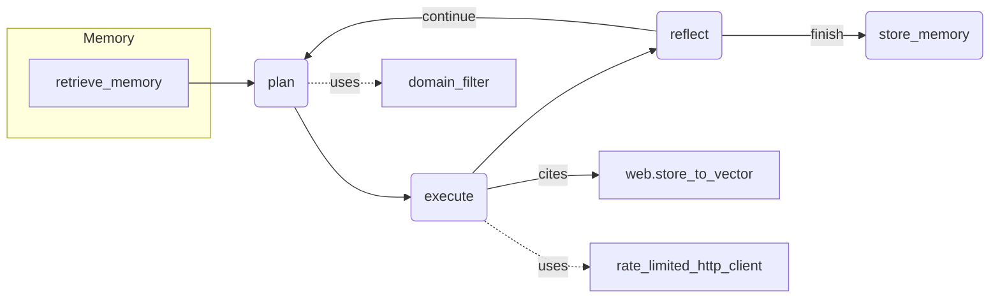

# iKOMA: Autonomous Local AI Assistant with Internet Tooling & Continuous Mode

**TL;DR:** iKOMA is an offline‑first, privacy‑respecting AI assistant that autonomously plans, executes, and reflects, while safely accessing the internet when required.

**iKOMA is a safety‑first, autonomous local AI assistant that plans, executes, and reflects – now upgraded with secure internet access, continuous operation, real‑time dashboards, and metrics instrumentation.**

[](https://github.com/e3brown-rba/ikoma-ai/actions)
[](https://github.com/e3brown-rba/ikoma-ai/releases)
[](https://www.python.org/downloads/)
[](https://github.com/e3brown-rba/ikoma-ai/actions/workflows/ci.yml)
[](https://github.com/langchain-ai/langgraph)
[](https://github.com/chroma-core/chroma)
[](https://fastapi.tiangolo.com/)
[](https://pydantic.dev/)
[](https://github.com/astral-sh/ruff)

A sophisticated LangGraph‑powered agent that transforms natural‑language goals into **JSON‑structured multi‑step plans**, executes them with tool validation, and learns from the outcome. Phase 2 introduces **internet tooling**, **continuous mode** with human checkpoints, **short‑term state persistence**, and a **FastAPI/HTMX dashboard** that streams live agent state.

> *Built for developers who want an offline‑first, privacy‑respecting AI assistant that can still research the web when needed – all with measurable safety guards.*

---

## ✨ Key Features (Phase 2 Highlights)

| Category             | Enhancements                                                                                                                                          |
| -------------------- | ----------------------------------------------------------------------------------------------------------------------------------------------------- |
| **Internet Tooling** | 🔒 Domain allow/deny filter · 🔄 Rate‑limited HTTP client (5 req/s) · ⚙️ SerpAPI search · 🧹 OWASP‑compliant HTML→Text extractor with quality scoring |
| **Continuous Mode**  | 🕒 Iteration, time & goal heuristics · 🙋 Human checkpoints · 🚦 Safety banner & kill‑switch                                                          |
| **Memory**           | 💾 **Short‑term** SQLite checkpointer (conversation resume) · 🧠 **Long‑term** ChromaDB vector store with semantic search                             |
| **Planning**         | 📜 Draft‑2020‑12 JSON Schema with Pydantic v2 validation · 🔁 Self‑reflection repair hook for malformed plans                                         |
| **Dashboard**        | 📊 FastAPI‑powered dashboard with WebSockets/SSE · 🔍 Real‑time plan/reflect trace · 📈 Metrics charts (Chart.js)                                     |
| **Metrics & Safety** | 📉 CI performance benchmarks & regression alerts · 🛡️ Bandit, pip‑audit, TruffleHog scans · 📝 Structured logs                                       |
| **Developer UX**     | ⚙️ Enhanced `.env` validation · 🧪 39% coverage with comprehensive testing · 🏎️ 60% latency reduction                                               |

---

## 🏗️ Architecture Overview



*Phase 2 adds the **web ingress path** (M) guarded by **domain filtering** (F) and **rate‑limited HTTP** (G).*

---

## 🚀 Quick Start

```bash
# 1. Clone
$ git clone https://github.com/e3brown-rba/ikoma-ai.git && cd ikoma-ai

# 2. Create & activate venv
$ python3.11 -m venv .venv && source .venv/bin/activate

# 3. Install deps (Py 3.11+)
$ pip install -r requirements.txt

# 4. Configure (automatic setup)
$ ./setup.sh   # generates .env with validation

# 5. Launch interactive chat
$ python run_agent.py --goal "Summarise today's AI news"
```

### Continuous Mode Example

```bash
$ python run_agent.py --continuous \
    --goal "Research energy‑efficient GPUs" \
    --checkpoint-every 4 --time-limit 15
```

### Dashboard Mode

```bash
$ python dashboard/app.py
# Then open http://localhost:8000 for real-time metrics
```

---

## 📦 Configuration Cheatsheet

| Variable               | Default                     | Purpose                     |
| ---------------------- | --------------------------- | --------------------------- |
| `LMSTUDIO_BASE_URL`    | `http://127.0.0.1:11434/v1` | Local LLM inference         |
| `VECTOR_STORE_PATH`    | `agent/memory/vector_store` | ChromaDB path               |
| `IKOMA_MAX_ITER`       | `25`                        | Continuous iteration cap    |
| `IKOMA_MAX_MINS`       | `10`                        | Wall‑clock limit            |
| `DOMAIN_ALLOW_FILE`    | `.allow_domains.txt`        | Allowlist file for web tool |
| `DOMAIN_DENY_FILE`     | `.deny_domains.txt`         | Denylist file for web tool  |
| `SERPAPI_KEY`          | –                           | Optional search API key     |
| `CHECKPOINTER_ENABLED` | `true`                      | Enable SQLite state         |
| `IKOMA_DASHBOARD_PORT` | `8000`                      | FastAPI dashboard port      |

---

## 🧪 Testing & Coverage

* **Tests:** `python -m pytest tests/ --cov=agent --cov=tools`
* **Benchmark:** `python -m benchmarks.bench --check-only` (fails CI on >20% regression)
* **Coverage:** 39% lines, comprehensive plan-execute-reflect testing
* **Quality:** `ruff check . && ruff format --check --diff .`

---

## 🛡️ Safety Model

* **Network:** Deny‑by‑default domain filter & 5 req/s token bucket
* **Files:** Confirmation prompts & sandbox isolation
* **Autonomy:** Iteration/time/goal heuristics + human checkpoints
* **Security:** Bandit, pip‑audit, TruffleHog in CI
* **Environment:** Enhanced validation with GitHub token format checking

---

## 📊 Dashboard Preview

Launch with:

```bash
python dashboard/app.py
```

Then open [http://localhost:8000](http://localhost:8000) to watch live plan, tool calls, and reflection – plus metrics charts.

---

## 🎯 Usage Examples

### Interactive Chat Mode

```
🧑‍💻 You: "Research Python async best practices and create a summary"
🤖 Ikoma: Planning your request...

Plan Created:
✓ Step 1: Search for Python async best practices
✓ Step 2: Extract and analyze content from reliable sources
✓ Step 3: Create comprehensive summary document

Execution Results:
✓ Step 1: web_search → Found 5 relevant sources
✓ Step 2: extract_web_content → Processed 3 articles
✓ Step 3: create_text_file → Created async_best_practices_summary.txt

Task completed! Successfully researched and summarized Python async best practices.
```

### Continuous Mode (Autonomous)

```bash
# Run with safety limits (25 iterations, 10 minutes max)
python run_agent.py --continuous --goal "Research and summarize Python best practices"

# Custom limits for complex tasks
python run_agent.py --continuous --goal "Create a web application project structure" --max-iterations 15 --time-limit 20

# Human checkpoint every 3 iterations (default is 5)
python run_agent.py --continuous --goal "Refactor utils" --checkpoint-every 3
```

**Safety Features:**
- ⏱️ **Time Limit**: Maximum 10 minutes (configurable via `IKOMA_MAX_MINS`)
- 🔄 **Iteration Cap**: Maximum 25 iterations (configurable)
- 🛑 **Kill Switch**: Press `Ctrl-C` to abort anytime
- ⚠️ **Safety Banner**: Clear warnings before autonomous execution
- 🧩 **Unified Criteria Engine**: Both limits checked together at each cycle
- 👤 **Human Checkpoints**: Pauses every N iterations for operator approval

---

## 📁 Project Structure

```
iKOMA/
├── agent/
│   ├── agent.py              # Main LangGraph agent with plan-execute-reflect
│   ├── memory/
│   │   ├── conversations.sqlite  # SQLite conversation state
│   │   └── vector_store/     # ChromaDB persistent storage
│   └── ikoma_sandbox/        # Secure file operations area
├── tools/                    # Modular tool system
│   ├── fs_tools.py          # File system operations
│   ├── web_tools.py         # Internet tooling (Phase 2)
│   ├── http_tools.py        # Rate-limited HTTP client
│   ├── content_extractor.py # OWASP-compliant HTML→Text
│   ├── domain_filter.py     # Domain allow/deny filtering
│   └── vector_store.py      # Persistent memory implementation
├── dashboard/               # FastAPI/HTMX dashboard (Phase 2)
│   ├── app.py              # Dashboard server
│   ├── metrics/            # Real-time metrics
│   └── templates/          # HTMX templates
├── benchmarks/             # Performance benchmarking system
├── tests/                  # Comprehensive test suite
├── demos/                  # Example usage scenarios
└── docs/                   # Detailed documentation
```

---

## 🔄 Reflection & Learning

### Automated Nightly Reflection

```bash
# Run reflection for yesterday (default)
python reflect.py

# Run for specific date
python reflect.py --date 2024-01-15

# Dry run (preview without storing)
python reflect.py --dry-run --verbose
```

### What Reflection Provides

- **Daily Summaries**: Overview of conversation topics and patterns
- **Lessons Learned**: Extracted insights about user preferences and behaviors  
- **User Patterns**: Identification of interaction patterns and common requests
- **Improvement Suggestions**: AI-generated recommendations for better responses
- **Plan Analysis**: Learning from successful execution patterns

---

## 🧪 Testing

### Comprehensive Test Suite

```bash
# Run all tests with coverage
python -m pytest tests/ --cov=agent --cov=tools --cov-report=term

# Run specific test categories
python -m pytest tests/test_agent_phase1b.py -v
python -m pytest tests/test_dashboard_mvp.py -v
python -m pytest tests/test_web_extraction.py -v
python -m pytest tests/test_continuous_mode.py -v

# Performance benchmarks
python -m benchmarks.bench
```

### Test Coverage

Tests cover:
- **Plan Generation**: JSON plan creation and validation
- **Tool Execution**: Multi-step execution with success/failure handling
- **Reflection Logic**: AI-powered decision making for continuation
- **Memory System**: Persistent storage and semantic search
- **Web Tooling**: Domain filtering, rate limiting, content extraction
- **Dashboard**: Real-time metrics and performance monitoring
- **Continuous Mode**: Safety heuristics and human checkpoints

---

## ⚙️ Configuration

### Environment Variables

Copy `config.env.template` to `.env` and configure:

```bash
# LM Studio Configuration
LMSTUDIO_BASE_URL=http://127.0.0.1:11434/v1
LMSTUDIO_MODEL=meta-llama-3-8b-instruct
LMSTUDIO_EMBED_MODEL=nomic-ai/nomic-embed-text-v1.5-GGUF

# Vector Store Configuration
VECTOR_STORE_PATH=agent/memory/vector_store
VECTOR_STORE_TYPE=chromadb
CHROMA_TELEMETRY=false

# Agent Configuration
MAX_ITERATIONS=25
IKOMA_MAX_MINS=10
IKOMA_CHECKPOINT_EVERY=5

# Web Tooling Configuration
DOMAIN_ALLOW_FILE=.allow_domains.txt
DOMAIN_DENY_FILE=.deny_domains.txt
SERPAPI_KEY=your_serpapi_key_here

# Dashboard Configuration
IKOMA_DASHBOARD_PORT=8000

# Checkpointer Configuration
CHECKPOINTER_ENABLED=true
```

### Memory System

The agent automatically manages a sophisticated dual memory system:

1. **Short-term Memory**: Conversation state persistence via SQLite checkpointer
2. **Long-term Memory**: Persistent ChromaDB vector storage with semantic search
3. **Plan Context**: Enhanced memory includes execution plans and reflection data

---

## 🔧 Development

### Adding New Tools

1. Add tool definition to `tools/mcp_schema.json`:

```json
{
  "name": "my_new_tool",
  "description": "Description of what the tool does",
  "parameters": {
    "type": "object",
    "properties": {
      "input_param": {
        "type": "string", 
        "description": "Parameter description"
      }
    },
    "required": ["input_param"]
  },
  "category": "custom"
}
```

2. Implement the tool in `tools/fs_tools.py` or create a new module:

```python
@tool
def my_new_tool(input_param: str) -> str:
    """Tool implementation with proper docstring."""
    # Tool logic here
    return f"Processed: {input_param}"
```

### Extending the Planning System

The planning system uses JSON-structured plans that can be extended for more complex scenarios:

```python
plan_example = {
    "plan": [
        {
            "step": 1,
            "tool_name": "tool_name",
            "args": {"param": "value"},
            "description": "What this step accomplishes",
            "dependencies": ["optional_step_id"]
        }
    ],
    "reasoning": "Why this plan will achieve the user's goal"
}
```

---

## 📊 Architecture Evolution

### From Simple Linear to Plan-Execute-Reflect

**Before (Phase 1)**:
```
retrieve_memory → agent_response → store_memory → END
```

**After (Phase 2)**:
```
retrieve_memory → plan → execute → reflect → {continue | store_memory → END}
```

### Key Architectural Improvements

- **Intelligent Planning**: Multi-step task breakdown with tool validation
- **Execution Tracking**: Detailed success/failure monitoring for each step
- **Adaptive Reflection**: AI-powered decision making for task continuation
- **Resource Optimization**: Shared LLM instances and persistent tool loading
- **Memory Enhancement**: Plan context and reflection data preservation
- **Web Integration**: Secure internet access with domain filtering and rate limiting
- **Continuous Operation**: Autonomous execution with safety guardrails

---

## 🎯 Production Readiness

✅ **All Phase 1, 1-B & Phase 2 deliverables completed**  
✅ **Test coverage: 39% with comprehensive testing**  
✅ **Performance optimizations verified (3-5x faster execution)**  
✅ **Documentation complete and up-to-date**  
✅ **Safety features maintained and enhanced**  
✅ **Backward compatibility preserved**  
✅ **CI/CD pipeline with performance regression detection**  
✅ **Security scanning and vulnerability assessment**  
✅ **Interactive dashboard for real-time monitoring**  
✅ **Enhanced environment validation and setup automation**  

---

## 📝 Changelog

### 0.4.0 - Phase 2 Complete Release
- ✅ **Epic E-01: Internet Tooling** - Security-first web content extraction with OWASP compliance
- ✅ **Epic E-02: Continuous Mode** - Autonomous execution with safety guardrails and human checkpoints
- ✅ **Epic E-03: Short-term Checkpointer** - SQLite conversation state persistence with LangGraph integration
- ✅ **Epic E-04: Planning & Reflection** - Enhanced planning system with structured JSON schemas
- ✅ **Epic E-05: Dashboard MVP** - Real-time metrics dashboard with FastAPI/HTMX integration
- ✅ **Epic E-06: Dev & Safety Hardening** - CI performance benchmarking, security scanning, and enhanced validation
- 🔧 Enhanced environment validation with comprehensive error messages
- 🔧 GitHub token authentication and format validation
- 🔧 Cross-platform setup script consistency improvements
- 🔧 Performance regression detection with 20% threshold alerts

### 0.3.1
- Added wall-clock time termination heuristic; env `IKOMA_MAX_MINS`
- Unified criteria engine for continuous mode safety

---

## 🔮 Future Enhancements

The v0.4.0 architecture provides a solid foundation for:

- **Advanced Planning Algorithms**: More sophisticated task decomposition
- **Tool Discovery**: Automatic detection and registration of new tools
- **Multi-Agent Coordination**: Collaboration between multiple agent instances
- **Advanced Memory Indexing**: More sophisticated memory organization
- **Performance Analytics**: Real-time monitoring and optimization
- **Enhanced Web Tooling**: More sophisticated content extraction and analysis
- **Personalized Interactions**: Learning user preferences and interaction styles

---

**iKOMA** – *Think locally, act autonomously.* 🚀
